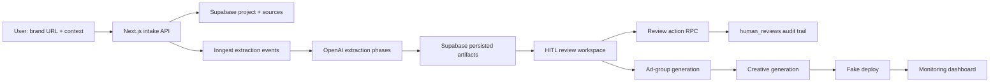

# Technical Architecture

## Stack

| Layer | Technology |
|---|---|
| Web app | Next.js 16, React 19, TypeScript |
| Styling/UI | Tailwind CSS, lucide-react |
| Database | Supabase Postgres with migrations, RLS, Realtime-ready tables |
| Server data access | Supabase service-role client boundaries |
| Background jobs | Inngest functions and event routes |
| Validation | Zod and typed TypeScript contracts |
| AI providers | OpenAI primary, fal.ai optional media path |
| Deployment target | Vercel for `apps/web`, Supabase in `cdg1` |

## Runtime Shape

## Main Execution Flow

1. `POST /api/projects` creates a project, sources, and optional product feed rows.
2. Extraction is requested through Inngest and recorded in `extraction_runs`.
3. OpenAI phases generate source recap, feature map, conversations, intent labels, landing gaps, and draft ad groups.
4. The review page reads persisted data and can poll or use Realtime-shaped updates.
5. `POST /api/projects/[projectId]/reviews` calls the database review RPC.
6. Approved rows feed `POST /api/projects/[projectId]/ad-groups/generate`.
7. Approved ad groups feed `POST /api/projects/[projectId]/creatives`.
8. Approved creatives feed `POST /api/projects/[projectId]/deploy`.
9. Monitoring reads deployments and performance snapshots through `GET /api/projects/[projectId]/deploy`.

## Data Model

Core tables:

| Table | Responsibility |
|---|---|
| `projects` | One brand/campaign workspace. |
| `sources` | URL, text, product feed, and provider ingestion material. |
| `extraction_runs` | Phase status, provider metadata, prompts, inputs, outputs, errors, timings. |
| `brand_features` | Features, value props, use cases, proof points, objections. |
| `conversations` | Buying conversations, stage, intent, buyer role, constraints. |
| `landing_gaps` | Missing proof, setup, comparison, pricing, trust, or compliance content. |
| `campaigns` | OpenAI Ads-shaped campaign container. |
| `ad_groups` | Campaign groupings tied to conversations, features, and gaps. |
| `creative_variants` | Titles, descriptions, angles, prompts, asset URLs, provider payloads. |
| `human_reviews` | Before/after audit rows for approve/edit/reject/enrich actions. |
| `deployments` | Fake-deploy package and status. |
| `performance_snapshots` | Simulated or imported KPI rows and generated insight text. |
| `product_feeds`, `product_feed_items` | Optional feed ingestion and export-ready product rows. |

Design choices:

- UUID primary keys on product data.
- `created_at` and `updated_at` on persisted entities.
- JSONB storage for provider requests/responses and replayable payloads.
- RLS enabled across the Motive tables.
- Indexes on project, status, review status, and major relationship fields.
- Review status enums make the workflow explicit and queryable.

## Human Review Model

The `review_entity_action` RPC centralizes review actions. It supports:

- `approve`
- `edit`
- `reject`
- `enrich`

For editable entities it validates supported patch fields, updates the target row, and inserts a `human_reviews` record containing:

- entity type
- entity ID
- action
- before JSON
- after JSON
- comment
- reviewer metadata

This is important for judging because the system does not treat model output as final. Human corrections become first-class data.

## Provider Boundaries

OpenAI calls are isolated behind provider helpers. The database records model, prompt version, input, output, response IDs, usage, and errors where available.

fal.ai is optional. If `FAL_KEY` is absent, creative generation can still produce title, description, angle, and asset prompts. This keeps the demo resilient.

Tavily and Pioneer are intentionally not hard dependencies in the current demo path. Tavily is the planned source-crawling upgrade; Pioneer is the planned specialist classifier once Motive has a training corpus from OpenAI labels, human reviews, and performance snapshots.

## Resilience And Demo Safety

- Seeded mode can reset a deterministic project for judging.
- Auto mode falls back to fixtures when provider keys are missing.
- Extraction failures are persisted per phase instead of erasing previous rows.
- Downstream phases can be marked as skipped when dependencies fail.
- Fake deployment avoids external ad-platform risk while preserving the product story.
